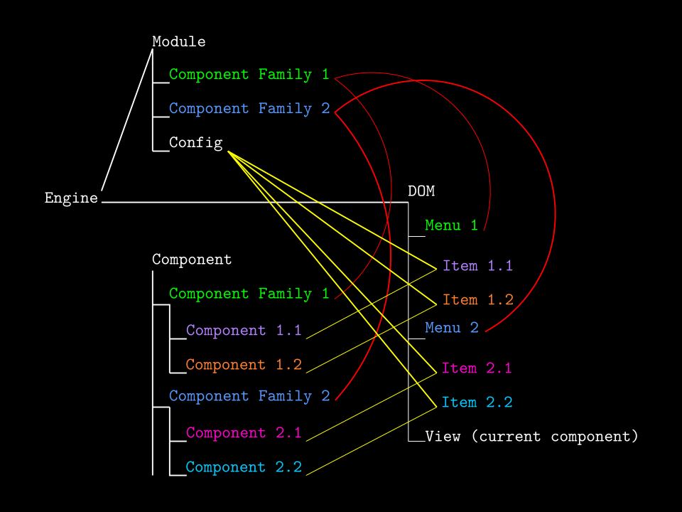

# Specimina

Specimens for HTML, CSS and vanilla JS.

## Access

To view the code: **https://github.com/joesyverson/specimina**

To view the site: **https://joesyverson.github.io/specimina/**

## Implementation

### Purpose

The purpose of this website is to experiment with raw HTML, CSS and JS.

### Development Process

The website was initially conceived of as static -- just HTML and CSS. Java script has been added to create a custom but rudimentary single-page component system, but it has not yet circumvented the original structure of the website. Future development will target increased dynamicism in component creation. As for now, the JS just makes the HTML more intelligible by introducing components. Before that, the CSS will be refactored for DRY-ness and more logical semantics. New components that I have not played around are also due for an appearance, plus some JS hacks for extra attention to stylistic detail. In the meantime, I'll be doing my real job.

### Diagram



### Tree

```
.
├── CNAME
├── Dockerfile
├── etc
│   └── nginx
│       └── conf.d
│           └── default.conf
├── img
│   ├── berniniGianLorenzo_theEcstasyOfSaintTeresa-1645to1652_320x328-px.jpg
│   ├── berniniGianLorenzo_theEcstasyOfSaintTeresa-1645to1652_860x826-px.jpg
│   ├── favicon.html
│   ├── favicon.png
│   └── favicon.svg
├── index.html
├── LICENSE
├── Makefile
├── module
│   ├── conf
│   │   ├── appendix.js
│   │   ├── conf-dev.js
│   │   ├── conf-prod.js
│   │   └── exhibit.js
│   ├── data
│   └── html
│       ├── appendix
│       │   └── table.html
│       └── exhibit
│           ├── form.html
│           ├── img.html
│           ├── p.html
│           └── table.html
├── README.md
├── script.js
└── style.css

10 directories, 23 files
```